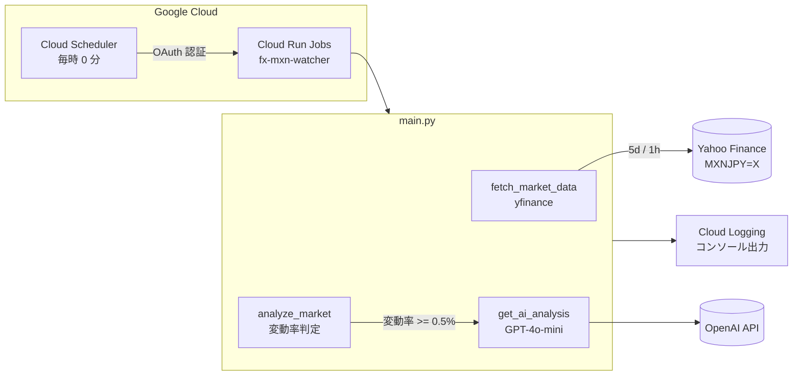

# AI Market Watchdog (MXN/JPY)

[](https://www.python.org/)
[](LICENSE)

MXN/JPY レートを 24 時間監視し、急変動時に AI（OpenAI GPT-4o-mini）が相場解説を生成するバッチ Bot。Google Cloud Run Jobs + Cloud Scheduler で毎時自動実行されます。

<!-- TODO: screenshot -->

## このツールで解決する問題

メキシコペソ円の長期スワップ運用では、相場の急変動をリアルタイムで把握することが難しく、気づいたときには含み損が大きく拡大しているケースがあります。本 Bot は毎時自動で相場を監視し、変動率 0.5% 以上のアラート時に AI による解説を自動生成します。平時は「異常なし」ログで安定稼働を確認できます。

---

## 主な機能

- **MXN/JPY の 24 時間監視**（yfinance 経由）
- **変動率 0.5% 以上で自動アラート**（コンソール出力）
- **OpenAI GPT-4o-mini による相場解説**（日本のFXスワップ投資家向けに最適化）
- **Cloud Run Jobs + Cloud Scheduler で毎時自動実行**

---

## 技術スタック

| カテゴリ | 技術 |
|---|---|
| 言語 | Python 3.11+ |
| データ取得 | yfinance |
| AI 分析 | OpenAI GPT-4o-mini |
| 実行基盤 | Google Cloud Run Jobs |
| スケジューラ | Google Cloud Scheduler |
| コンテナ | Docker (python:3.11-slim) |

---

## セットアップ手順

### 1. リポジトリのクローン

```bash
git clone https://github.com/tomomira/ai-market-watchdog-mxn.git
cd ai-market-watchdog-mxn
```

### 2. Python 仮想環境の構築

```powershell
# Windows PowerShell
python -m venv venv
.\venv\Scripts\Activate.ps1
pip install -r requirements.txt
```

```bash
# Linux / macOS / WSL
python -m venv venv
source venv/bin/activate
pip install -r requirements.txt
```

### 3. 環境変数の設定

`.env.example` をコピーして `.env` を作成し、OpenAI API キーを設定します:

```powershell
# Windows PowerShell
$env:OPENAI_API_KEY="sk-your-openai-api-key"
```

```bash
# Linux / macOS / WSL
export OPENAI_API_KEY="sk-your-openai-api-key"
```

### 4. ローカル実行

```powershell
python main.py
```

期待される出力:

```
=== AI FX Market Watcher (MXN/JPY) Started ===
[*] Fetching data for MXNJPY=X...
MXN/JPY Rate: 8.97円 (Change: 0.00%)
✅ 異常なし（安定推移）
=== End of Process ===
```

---

## GCP へのデプロイ

```bash
# Cloud Run Jobs へデプロイ
gcloud run jobs deploy fx-mxn-watcher --source . --region asia-northeast1

# 環境変数設定
gcloud run jobs update fx-mxn-watcher \
  --set-env-vars OPENAI_API_KEY="<YOUR_KEY>" \
  --region asia-northeast1

# Cloud Scheduler（毎時 0 分実行、OAuth 認証）
PROJECT_ID=$(gcloud config get-value project)
gcloud scheduler jobs create http fx-mxn-watcher-schedule \
  --location=asia-northeast1 \
  --schedule="0 * * * *" \
  --time-zone="Asia/Tokyo" \
  --uri="https://asia-northeast1-run.googleapis.com/apis/run.googleapis.com/v1/namespaces/${PROJECT_ID}/jobs/fx-mxn-watcher:run" \
  --http-method=POST \
  --oauth-service-account-email="cloud-scheduler-runner@${PROJECT_ID}.iam.gserviceaccount.com"
```

> Cloud Run **Jobs** は OAuth 認証が必須（OIDC 不可）。詳細は [docs/internal/トラブルシューティング.md](docs/internal/トラブルシューティング.md) 参照。

---

## アーキテクチャ



---

## ディレクトリ構成

```
ai-market-watchdog-mxn/
├── main.py                 # メインプログラム（監視・AI分析ロジック）
├── requirements.txt        # 依存ライブラリ
├── Dockerfile              # GCP デプロイ用コンテナ定義
├── .env.example            # 環境変数テンプレート
├── .gitignore
├── recreation_commands.md  # GCP ジョブ再作成コマンド集
├── LICENSE
└── docs/
    └── internal/           # 社内運用ドキュメント（外部読者向けでない）
        ├── README.md
        ├── トラブルシューティング.md
        ├── 進捗_次回作業メモ.md
        └── ID002_AI_FX市場監視Bot_実装・運用手順書_メキシコペソ版.md
```

---

## 運用コスト

| サービス | 費用 |
|---|---|
| Google Cloud Run Jobs | 無料枠内（月額 ¥0） |
| Google Cloud Scheduler | 無料枠内（月額 ¥0） |
| OpenAI API (GPT-4o-mini) | 変動 0.5% 超のときのみ呼び出し → 月額数十円程度 |

---

## トラブルシューティング要約

| 症状 | 原因 | 対処 |
|---|---|---|
| Cloud Scheduler が 401 エラー | OIDC 認証を誤って設定 | OAuth 認証（`--oauth-service-account-email`）で再作成 |
| yfinance で型エラー | Python 3.9 以下 | Dockerfile を `python:3.11-slim` に変更 |
| デプロイ時 WinError 1920 | venv が Cloud Build に混入 | `.gcloudignore` で `venv/` を除外 |
| 環境変数が反映されない | deploy がリセットする仕様 | deploy 後に `--update-env-vars` で個別設定 |

詳細は [docs/internal/トラブルシューティング.md](docs/internal/トラブルシューティング.md) 参照。

---

## 関連プロジェクト

- [fx-monitoring-dashboard](https://github.com/tomomira/fx-monitoring-dashboard) — Slack 通知統合版（本 Bot の発展型）

---

## 解説記事

> 📝 [【続編】FXメキシコペソ版・AI市場監視Botで「不労所得の死活監視」を自動化してみた](https://note.com/lively_hippo6176/n/nff0d7792bf5b)

---

## ライセンス

MIT License — 詳細は [LICENSE](LICENSE) 参照。
